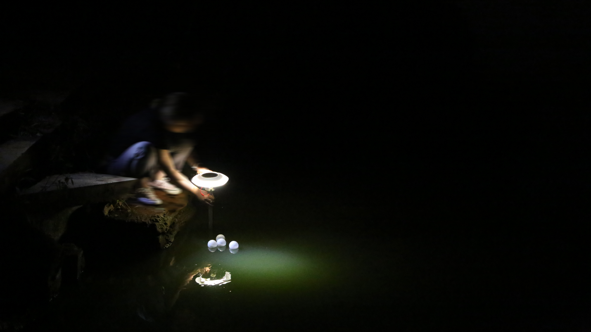

# ResPOND

**ResPOND** is a research prototype exploring night-time pond-care through low-cost sensing, Bluetooth-based data transmission, and web-based visualization. It was developed as part of a design research project on rural fish pond hypoxia, small-scale aquaculture, and more-than-human pond-care relations.

This repository contains the Arduino code, web interface, 3D printing model files, and supporting design documentation for the ResPOND prototype.

## Live Web Demo

The web-based Bluetooth visualization can be accessed here:

https://yuyaolin042.github.io/ResPOND2/

The interface receives sensor data from the prototype and visualizes fish movement / vibration-related signals, shaken counts, and motor trigger events.

## Videos

### Demo Video

A short demo showing the ResPOND prototype and web-based Bluetooth visualization in use.
[Watch the demo video](https://youtu.be/-sM7XNfoZp4?si=Gn7xAY6S40rEIeUO)

### Full Project Video

A full video introducing the design context, prototype concept, sensing logic, and night-time pond-care scenario.
[Watch the full project video](https://youtu.be/VWaMvkhdfQA?si=AberRkaxo1d45DwR)

## Project Deck

The project presentation deck provides a broader overview of the design context, pond hypoxia problem, prototype workflow, sensing logic, structure, field validation, and farmer feedback.

[View the ResPOND project deck](docs/ResPOND_Project_Deck.pdf)

## Visual Overview

The following images show the ResPOND concept, night-time testing, and physical prototype.

### Scenario Render


A visual scenario showing ResPOND deployed in a pond environment, surrounded by floating sensing units and fish activity.

### Night-Time Testing



A night-time testing scene showing the ResPOND prototype being placed in a pond-like environment and illuminated during low-light conditions.

### Prototype Close-up


A close-up view of the ResPOND prototype, showing the floating structure, lighting, and surrounding pond-care scenario.

## Repository Contents

```text
ResPOND2/
  README.md
  index.html
  ResPOND_Arduino.ino

  hardware/
    3D_printing_models/

  docs/
    ResPOND_Project_Deck.pdf

  media/
    respond_scenario_render.gif
    respond_night_testing.jpg
    respond_prototype_closeup.jpg
```

## Hardware

The `hardware/` folder includes the 3D printing model files for the ResPOND prototype structure.

The current prototype uses multiple motion / vibration sensing inputs to detect possible abnormal fish activity and transmits the data to the web interface via Bluetooth. The Arduino code controls sensing input, signal interpretation, and motor-triggered response logic.

## Notes

ResPOND is a design research prototype rather than a commercial aquaculture product. This repository is intended to document the technical prototype, web-based visualization, 3D printing files, and supporting design materials for research and demonstration purposes.

